# Questions générales sur le profil des pilotes

En premier lieu, une approche quantitative nous permet de répondre à des questions prosopographique concernant les pilotes de la Première Guerre mondiale. Nous pouvons commencer par préciser leur profil et donc répondre à la question de "Qui sont-ils"?

La réponse se repose surtout sur les carnets de distributions (trois dans le projet). 

Premièrement, nous pouvons nous concentrer sur l’allégeance, c’est-à-dire le pays belligérant pour lequel il a combattu. En réalité, cette donnée provient surtout de l'origine / nationalité des pilotes. Néanmoins, comme nous parlons du début du XXe siècle, cela reste très fiable. Pour répondre à la question, on regarde simplement les proportions 

## Proportion des allégeances
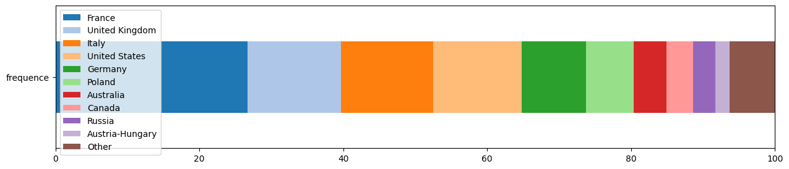

Le graphique nous permet de distinguer que sur nos ~ 1065 pilotes, le plus grand bloc est de loin celui de la France à près de 30%. 

## Proportion des alliances
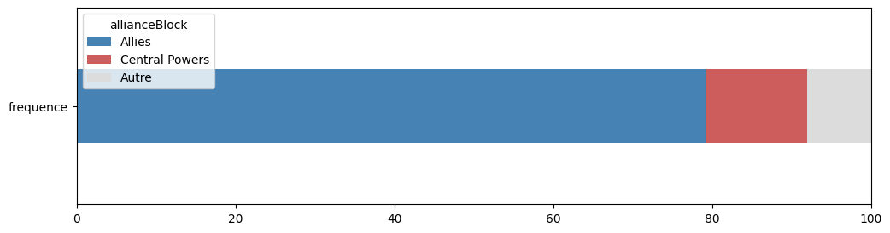

On décide alors de regrouper nos nationalités selon les deux grands blocs d'alliances de la Première Guerre mondiale: Les Alliés et les Puissances centrales. 
Il apparait alors une prépondérance écrasante des pilotes alliés, à près de 80% des effectifs. 
Il est difficile d'affirmer que cela reflète bien les réalités de la Guerre. Au moins, cela nous renseigne sur les biais des données de Wikidata et des analyses qui en découle. 

## Distribution des naissances et morts

Sans surprise, les dates et cohortes de naissances nous renseignent beaucoup sur le profil des as et permettent de répondre à plusieurs de nos questionnements. 
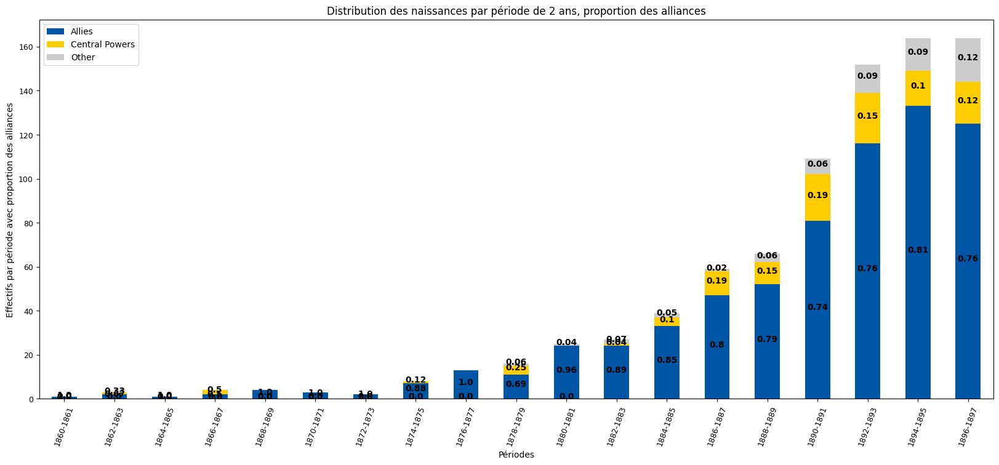

Le graphique confirme que les pilotes sont généralement très jeunes. Les trois dernières cohortes de 2 ans (de 1892 à 1897) ressortent largement. 

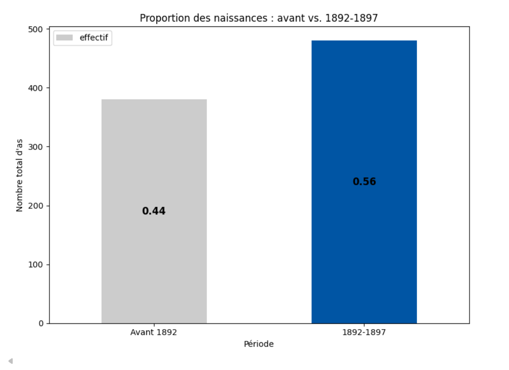

Ceci confirme l'hypothèse, 56 % des pilotes proviennent de la cohorte 1892-1897, ils ont alors entre 22 et 17 ans dès le début du conflit.
L'effet est d'autant plus marquant lorsque l'on considère que 3 "plages" de naissances surpassent l'effectif de 16 autres. 

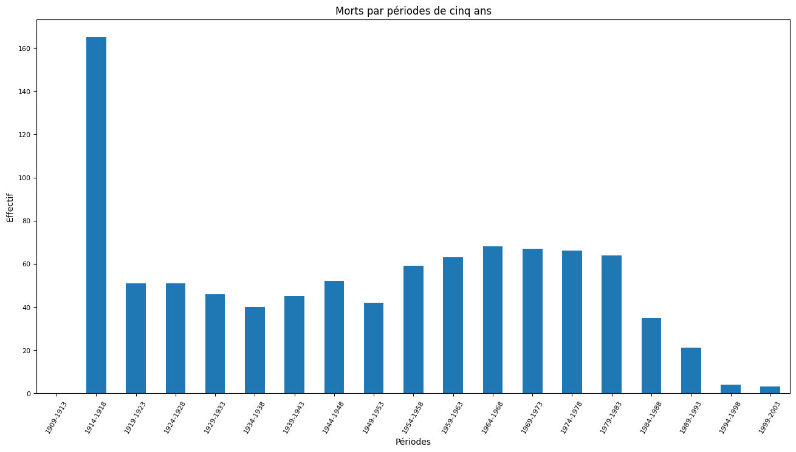
Bien que cela semble évident, la distribution des morts, sur une période de cinq démontre clairement l'impact de la Première Guerre mondiale à l'inverse de causes de mort "plus naturelle". 

Lorsque l'on précise l'analyse à la période 14-18, en se penchant sur des cohortes d'une année.
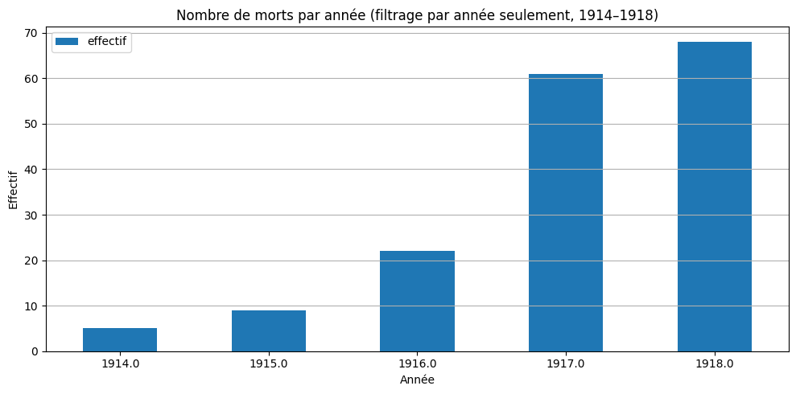
Nous pouvons alors observer que la grande majorité des fatalités ont eu lieu en 1917 et 1918. Cela confirme l'extension du secteur de l'aviation durant la Guerre. Nous avons alors affaire à des pilotes qui n'ont sûrement même pas 20 ans. 

## Décorations et allégeances
Finalement, beaucoup d'analyses ont pu être menées sur les décorations, étant donné qu'autrement, la variété de données sur les as est plutôt faible dans Wikidata.

Premièrement, on peut utiliser des distributions simples qui nous renseignent sur plusieurs éléments. Ainsi, on peut partiellement répondre à la question de quelle période est concernée. Nous observons un pique pendant la guerre et juste après. Cela indique bien que les "awards dates" de Wikidata concerne souvent des décorations décernées pendant le conflit.
")

Néanmoins, lorsque l'on décide de comparer les effectifs pendant 14-18 vs. hors 14-18. On s'aperçoit que seul un quart des "awarding events" ont eu lieu durant le conflit.

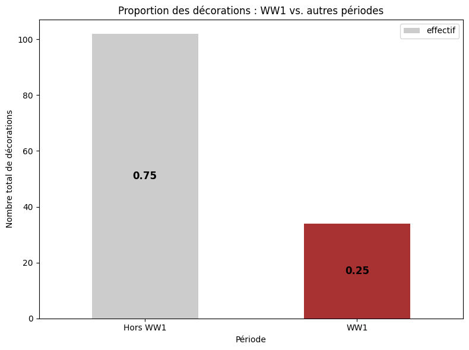

Si on se penche sur les générations qui ont majoritairement obtenues les décorations, en regroupant par cohorte de cinq ans, on distingue que l'écrasante majorité concerne les générations de 1890-1899. Ce sont donc encore ces jeunes hommes, pour qui la mortalité semble être haute, qui sont également très décoré. Cela peut sembler logique: il sont très actifs au combat comme la distribution des morts le démontre, ils ont donc plus de chances de commettre des actes héroïque. 

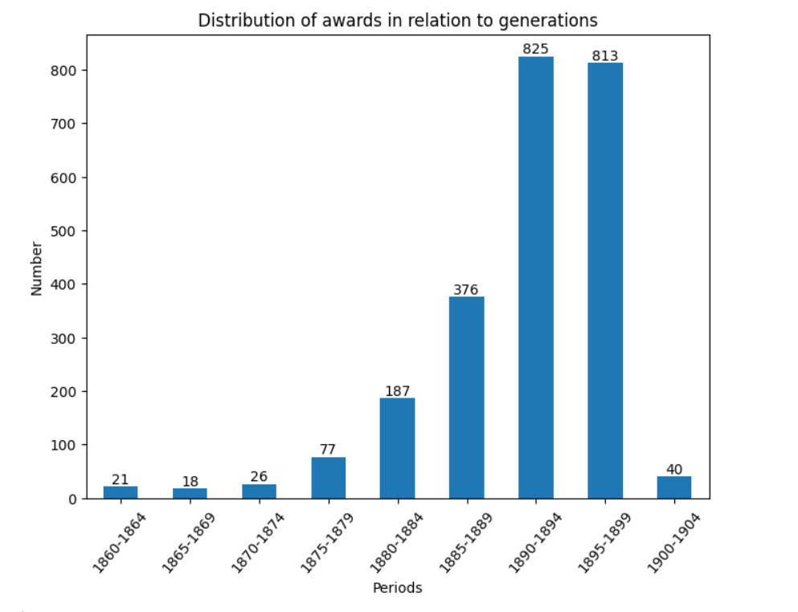

# Décorations: analyse bivariée et réseau
Ici, on cherche à répondre au questionnement: L’allégeance a-t-elle un impact sur la probabilité de recevoir ou non une récompense ?

Grâce à une analyse bivariée des alliances en relation avec les cohortes de naissance et les décorations obtenues, nous pouvons observer certaines tendances dans le temps.

Premièrement, si on normalise les effectifs entre les deux blocs d'alliance. On peut s'apercevoir que certaines cohortes de naissances semble avoir eu plus de probabilités de recevoir des décorations.

")

Notamment, la dernière cohorte qui n'a à peine 18 ans durant le conflit, a en moyenne reçue beaucoup plus de décorations du côté des puissances centrales (principalement l'ALlemagne) que du côté allié. 

Afin de tester si l’allégeance a un impact sur la probabilité de recevoir une récompense, nous avons réalisé une analyse croisant les blocs d’alliances (Alliés, Puissances centrales, Autres) et la variable binaire « a reçu une récompense / n’a pas reçu de récompense ». 

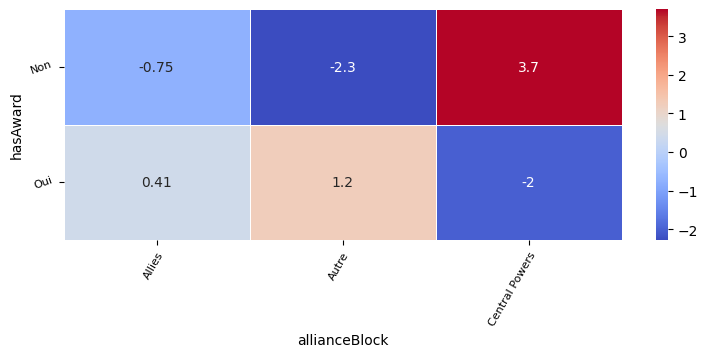

Le test du Chi² est significatif (Chi² = 25.2, ddl = 2, p < 0.001). La statistique de Cramer (V = 0.16) indique une association de force faible à modérée.  
Concrètement, les pilotes des Alliés sont surreprésentés parmi les pilotes décorés, tandis que ceux des Puissances centrales sont surreprésentés parmi les pilotes non décorés.  
Cela confirme que l’allégeance joue un rôle non négligeable dans la probabilité d’obtenir une décoration.

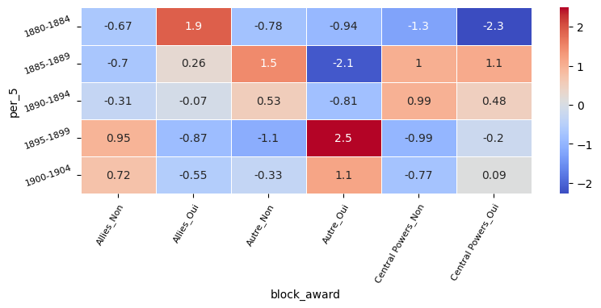

Finalement, si on ajoute les périodes dans les calculs, on distingue que l'impact de l'allégeance à un groupe d'alliance varie selon les cohortes de naissance (effet générationnel). Ce qui était visible avec le premier graphe de ce chapitre, les moyennes de récompenses. 

# Réseau

Finalement, si on applique un réseau à nos décorations, on cherche alors à répondre aux questions:

* Quelles décorations jouent un rôle de « nœuds centraux » dans le système des récompenses ?

* Existe-t-il des « ensembles typiques » de décorations attribuées conjointement ?

Etant donné que nous avons un nombre très conséquent de décorations différentes, on se concentre sur les 10 plus fréquentes. C'est-à-dire, les 10 décorations qui ont été décernées au plus de pilotes. 

tant donné le nombre très conséquent de décorations différentes, nous nous concentrons sur les **10 plus fréquentes**, c’est-à-dire celles qui ont été décernées au plus grand nombre de pilotes.

Dans ce réseau, chaque nœud correspond à une décoration et chaque arête (edge) relie deux décorations lorsqu’elles ont été attribuées au même pilote. Le poids de l’arête indique combien de pilotes partagent ces deux distinctions. Plus de pilotes ont le même lien, plus l'arête est épaisse.   
Pour analyser l’importance relative des nœuds, on utilise des mesures de centralité : la betweenness mesure le rôle d’une décoration comme « pont » reliant différents groupes, tandis que l’eigenvector permet de mesurer l'influence. Si une décorations a un "score élevé", c'est qu'elle est elle-même connectée à d'autres décorations très partagées. 

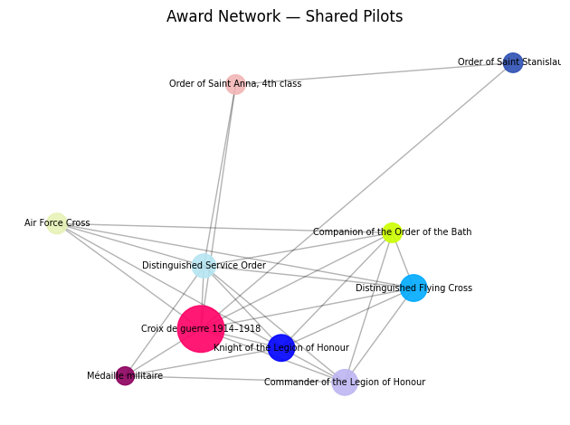

Ce graphe montre clairement des regroupements par traditions nationales :
- les décorations françaises (Croix de guerre, Légion d’honneur, Médaille militaire) forment un cluster cohérent ;
- les décorations britanniques (Distinguished Flying Cross, Distinguished Service Order, Air Force Cross, Order of the Bath) apparaissent elles aussi fortement connectées ;
- les décorations russes (Ordre de Saint-Anne, Ordre de Saint-Stanislas) restent périphériques, peu liées au reste du réseau.

Les analyses ont également permis de mesurer la centralité des décorations.

")

Ce graphique met en évidence :
- la **Croix de guerre 1914-1918** comme la décoration la plus centrale (haut eigenvector, attribuée à de nombreux pilotes et connectée aux autres décorations) ;
- le **Distinguished Flying Cross** comme une distinction jouant un rôle de pont (betweenness élevé), reliant le bloc britannique à d’autres ;
- globalement, la hiérarchie des décorations reflète la prédominance des traditions françaises et britanniques.

# Limitation du projet
Finalement, il est nécessaire de bien préciser que le projet ici est surtout un exercice et ne permet pas réellement de tirer des conclusions tangibles sur les pilotes de la Première Guerre mondiale. Surtout, le travail renseigne sur les données de Wikidata sur le sujet.

Certes, nous avons environ 1000 pilotes, ce qui devrait être suffisant pour des analyses statistiques pertinentes. Néanmoins, nous l'avons vu, il n'existe aucune homogénéité dans les informations. Nous avons observé seuls 120 pilotes pour les puissances centrales, ce qui semble douteux. Les pilotes sont donc principalement Français et Anglais, ce qui ne reflète probablement pas les véritables proportions dans la Guerre. Ainsi, de nombreux biais sont indéniables. 

Il est évident que comme n'importe qui peut créer un compte Wikidata et compléter les informations, le travail a été plus assidu du côté Français et Anglais que pour les autres. 